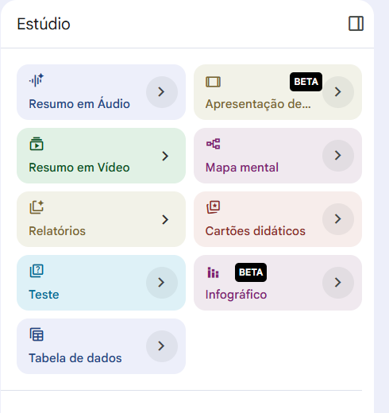
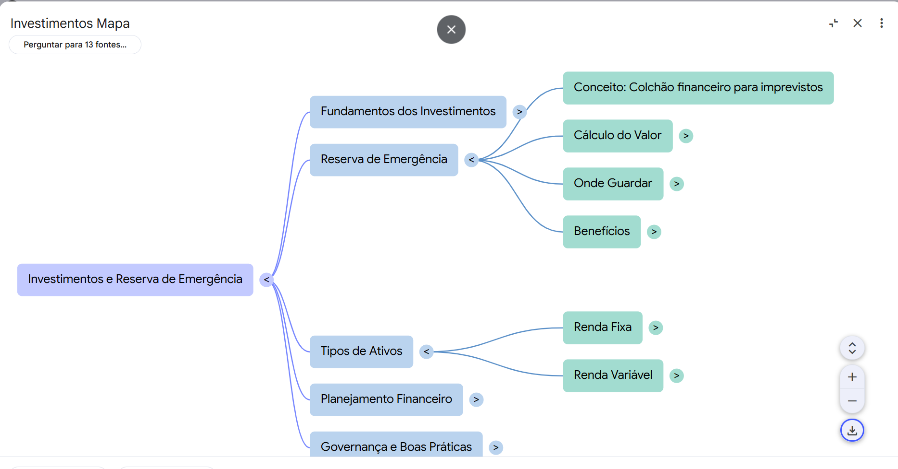
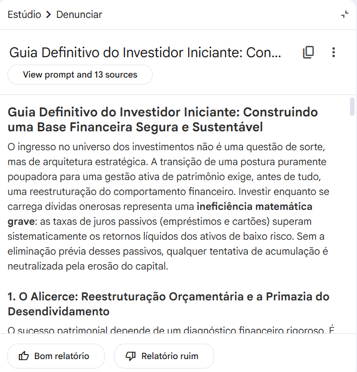
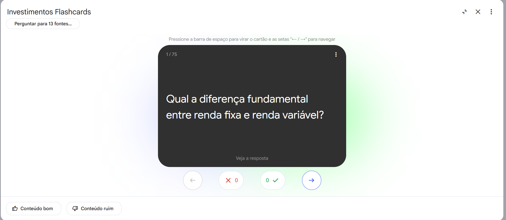
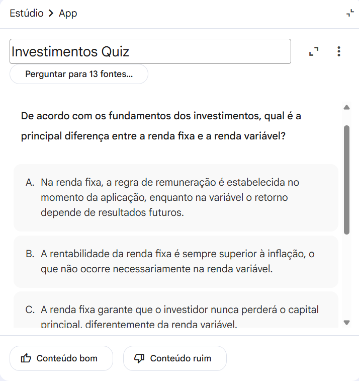

## 🚀 Funcionalidades do NotebookLM Exploradas

Durante o desenvolvimento deste projeto, foram utilizadas diversas funcionalidades do NotebookLM para transformar fontes de informação em materiais estruturados de estudo.

### 🎙️ Resumo em Áudio

Permite converter o conteúdo analisado em um formato de podcast ou conversa em áudio, facilitando revisões e aprendizado em diferentes contextos.

### 🎥 Resumo em Vídeo

Gera uma apresentação visual resumindo os principais conceitos identificados nas fontes carregadas.

### 🗺️ Mapa Mental

Cria representações visuais dos conceitos estudados, auxiliando na compreensão das relações entre os temas.

### 📑 Relatórios

Produz documentos organizados contendo resumos estruturados e análises dos conteúdos estudados.

### 🃏 Cartões Didáticos

Gera flashcards automaticamente para reforçar a memorização e revisão dos conceitos aprendidos.

### 📝 Teste

Cria questionários para validar o aprendizado e identificar pontos que precisam de revisão.

### 📊 Tabela de Dados

Organiza informações em formato tabular, facilitando comparações e análises.

### 🎨 Infográfico

Transforma informações complexas em representações visuais mais intuitivas e de fácil compreensão.

---

### Benefícios Obtidos

* Organização eficiente do conhecimento.
* Aprendizado mais dinâmico e interativo.
* Revisão facilitada por diferentes formatos de conteúdo.
* Maior retenção dos conceitos estudados.
* Apoio da Inteligência Artificial na síntese e estruturação das informações.
