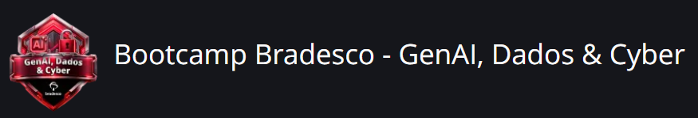
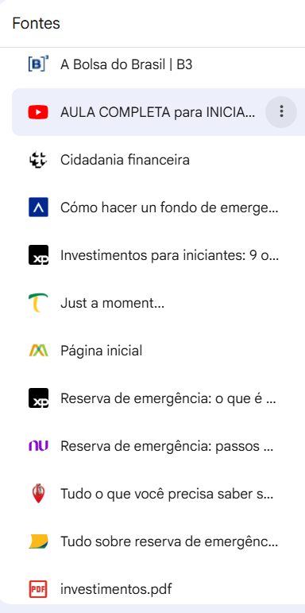

---

  

# 📚 Caderno Temático com NotebookLM: Introdução aos Investimentos
## 🔗 Acesso ao NotebookLM

[Visualizar NotebookLM](https://notebooklm.google.com/notebook/3427d053-e909-409a-87fd-ff76d1b54f5b?authuser=1)

## 📖 Sobre o Projeto

Este projeto foi desenvolvido como parte do desafio do Bootcamp Bradesco - GenAI, Dados & Cyber junto a DIO. me, utilizando o NotebookLM como ferramenta de estudo e organização do conhecimento.

---

## 🔗 Acesso ao NotebookLM

O caderno temático completo pode ser acessado através do link abaixo:

[NotebookLM - Introdução aos Investimentos](https://notebooklm.google.com/notebook/3427d053-e909-409a-87fd-ff76d1b54f5b?authuser=1)

> Observação: O notebook foi desenvolvido com base em fontes de educação financeira e investimentos para iniciantes.

---

## 🎯 Objetivos de Aprendizagem
Compreender os fundamentos da educação financeira.
Conhecer os principais tipos de investimentos.
Entender a relação entre risco, liquidez e rentabilidade.
Aprender a importância da reserva de emergência.
Identificar os diferentes perfis de investidor.
Explorar estratégias de diversificação e proteção patrimonial.
## 📂 Fontes Utilizadas

As informações foram obtidas a partir de materiais relacionados a:

Educação Financeira
Tesouro Direto
Reserva de Emergência
Renda Fixa
Renda Variável
Perfil do Investidor
Diversificação de Carteira
Fundo Garantidor de Créditos (FGC)

Todas as fontes foram organizadas e analisadas dentro do NotebookLM.

## 🧠 Engenharia de Prompts

Durante o desenvolvimento do projeto foram realizados diversos questionamentos para aprofundar o entendimento dos temas estudados.

Exemplos de Prompts Utilizados
O que é educação financeira e por que ela é importante?
Explique renda fixa para uma pessoa sem conhecimento financeiro.
Compare renda fixa e renda variável.
O que é reserva de emergência e como ela deve ser construída?
Explique a relação entre risco, liquidez e rentabilidade.
Quais cuidados devo tomar para evitar fraudes financeiras?
## 📌 Principais Aprendizados
- Educação Financeira

A educação financeira permite maior autonomia e segurança na tomada de decisões relacionadas ao dinheiro.
- Reserva de Emergência
  
Representa a base da organização financeira e deve cobrir entre 6 e 12 meses do custo de vida.
- Renda Fixa

Investimentos com regras de remuneração definidas no momento da aplicação, oferecendo maior previsibilidade.
- Renda Variável

Investimentos sujeitos às oscilações do mercado, com maior potencial de retorno e maior risco.
- Diversificação

Estratégia utilizada para distribuir riscos entre diferentes ativos e classes de investimentos.
- Perfil do Investidor

O conhecimento do perfil de risco é essencial para selecionar investimentos adequados aos objetivos pessoais.

## 📋 Perguntas de Revisão

Algumas questões utilizadas para consolidar o aprendizado:

O que é educação financeira?
Qual a diferença entre renda fixa e renda variável?
O que compõe o tripé dos investimentos?
Como calcular uma reserva de emergência?
O que significa liquidez?
Quais são os principais tipos de risco?
O que é suitability?
Por que diversificar investimentos?
Como funciona o FGC?
Qual a importância da inflação para o investidor?
## 🚀 Ferramentas Utilizadas
* NotebookLM
* GitHub
* Markdown
* Inteligência Artificial Generativa
## ✅ Conclusão

O NotebookLM demonstrou ser uma ferramenta eficiente para organizar conteúdos, sintetizar informações e apoiar processos de aprendizagem.

A utilização de IA generativa permitiu acelerar a compreensão dos conceitos financeiros, estruturar materiais de estudo e criar um ambiente de aprendizado mais produtivo e organizado.
